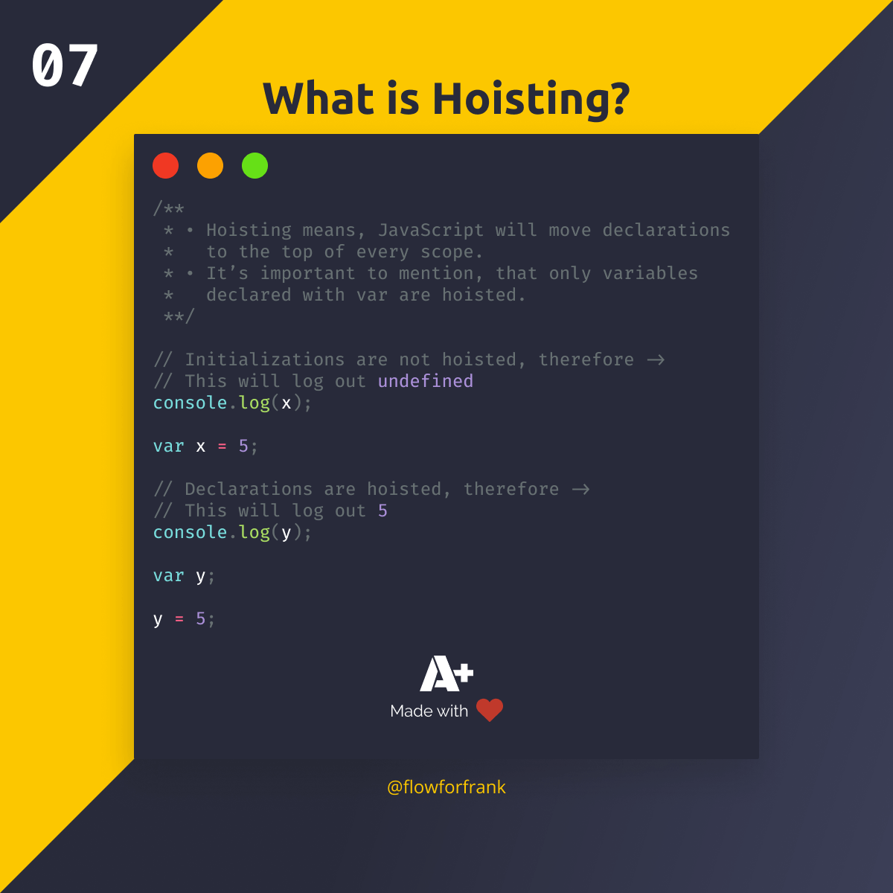
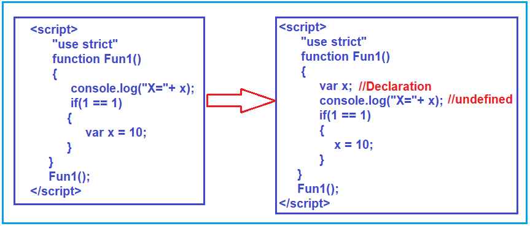

# ___Scope в JavaScript___
Область видимости переменных или просто “Область видимости”— это такая область программы, в пределах которой установлена связь между некоторой переменной и её идентификатором (именем), по которому можно получить значение этой переменной.

Для понимания этой концепции можно привести следующую аналогию. Представим человека, которому была назначена деловая встреча в некотором бизнес-центре, где он раньше не был. Он заходит в нужный кабинет и так как там еще никого нет, он решает узнать время, для этого ему необходимы часы. Этот человек начинает искать часы, обнаруживает настольные часы и узнаёт по ним время.

В данной аналогии:

* область видимости (scope) — это кабинет;
- имя переменной, по которой происходит поиск нужного   предмета, это “часы” (обозначим как clock);
- в данной области видимости, с этим идентификатором (“часы”) ассоциируются настольные часы. Здесь стоит вспомнить, что переменные, это своего рода контейнеры (области памяти), для хранения необходимых значений. Именно настольные часы в рамках кабинета выступают неким контейнером для хранения времени.
- значение этой переменной обозначим как “время на настольных часах”.

## Виды Scope
1. Глобальная область видимости. Она охватывает всю программу. Переменные и функции, объявленные в глобальной области видимости, могут быть доступны в любом месте программы.

2. Функциональная область видимости. Каждая функция в JavaScript имеет собственную область видимости. Переменные, объявленные внутри функции, видны только внутри этой функции и не могут быть доступны извне.

3. Блочная область видимости. Введена в ECMAScript 6 с помощью ключевых слов *let* и *const*. Блочная область видимости ограничивает видимость переменных только внутри блока кода, обычно определяемого фигурными скобками {}. Переменные, объявленные внутри блока, видны только внутри этого блока и недоступны за его пределами.

# ___Что такое Hoisting в JavaScript___
*Hoisting – это механизм в **JavaScript**, который позволит сначала вызвать переменную, а потом передать в нее значения исходя из области видимости. Это работает с переменными и функциями.

## Поднятие переменных
Когда вы объявляете переменную с использованием ключевого слова `var`, "она поднимается вверх в текущей области видимости. Это означает, что переменную можно использовать до момента ее фактического объявления. Например:

«`javascript

console.log(myVar);  *//  Выведет undefined*

var myVar = 10;

«`

В этом примере, `myVar` поднимается вверх, но ей присваивается значение только после вызова `console.log`. Поэтому значение `myVar` равно `undefined`.

.png>)

## Преимущества
Hoisting имеет несколько преимуществ, которые делают его полезным в разработке JavaScript:

1. Улучшение читаемости кода: использование переменных и функций до их объявления может сделать код более легким для понимания. Это особенно полезно при использовании больших скриптов.

2. Гибкость: можно объявлять части в любом порядке, что делает код более гибким и удобным для изменений.

3. Поддержка рекурсии: позволяет рекурсии вызывать саму себя до объявления, что полезно в некоторых случаях.

